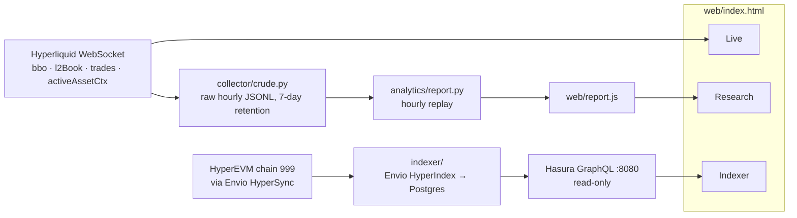

# HL Liquidity Console

Who makes the market on Hyperliquid, and who wins?

HL Liquidity Console is a market-microstructure analytics platform for
[Hyperliquid](https://hyperliquid.xyz) perpetuals. It records order-book and trade data
that can't be backfilled later, turns it into liquidity research (markouts, market-maker
P&L, concentration, price impact), and ships its own on-chain indexer for the HyperEVM
side of the chain. A single-page console shows all three.

It uses only public, read-only endpoints. Nothing trades and nothing signs a request.



## What's in it

### Live tab
Streams all 14 tracked markets straight from Hyperliquid's WebSocket in the browser:
- **Board:** price, spread, depth at ±2/10/50 bps, bid-vs-ask balance at the touch, funding APR, basis, open interest, 24h volume. Click a column to sort.
- **Selected market:** cumulative depth chart and a spread chart.
- **Trade tape:** every trade split into taker and maker addresses.
- **Across all coins:** a ticker of the largest trades and a pop-up alert for any trade of $500K or more.
- **Venue comparison:** the S&P 500 index listed on two HIP-3 deployers (`xyz:SP500` vs `mkts:US500`).

### Research tab
Built from the collector's history, which a live socket can't give you:
- **Markouts:** where the mid went 1s–5m after each fill, for takers, the top-10 makers, and all other makers. This measures adverse selection.
- **Market-maker league table:** each top maker's P&L per fill against the mid 5s and 60s later.
- **Informed flow:** the largest takers, ranked by whether price kept moving their way.
- **Concentration:** HHI and the share of volume held by the top N wallets, for makers and for takers.
- **Price impact by order size:** fills that one taker made in the same millisecond count as one order sweeping the book.
- **Intraday liquidity profile:** spread, depth and volume by UTC hour.
- **Funding and premium:** hourly means.
- **Data quality:** collector uptime, outages, l2Book cadence, and duplicate trades removed.

### Indexer tab
Query the Envio indexer with GraphQL from the page: pick an example or write your own, then see the result as a table, bars or JSON. Asset ids show as coin names, and addresses link to hyperevmscan.

The indexer covers every action a HyperEVM contract sends into HyperCore through CoreWriter: orders, cancels, USD and spot transfers, staking, and more. It also covers HYPE bridged into HyperCore.

## Findings so far

These are from the first ~24h of capture (BTC and `xyz:SP500`, Sept 2026) and the full HyperEVM history:

- **BTC makers are unconcentrated:** the top 5 of 2,737 maker wallets supply 22.5% of maker volume (HHI 197).
- **Takers are informed:** the mid moves 0.58 bps their way 60s after a fill. The ten biggest makers get picked off harder than the rest (−0.83 vs −0.44 bps).
- **Large orders pay more:** a $1M+ BTC order pays 2.88 bps of impact against mid, versus 0.39 bps under $1K. $1M+ orders are 45% of volume.
- **The public book is shallow:** Hyperliquid's 20-level book reaches only ~2.3 bps from mid on BTC, so any deeper depth is a lower bound.
- **HyperEVM usage:** 1.47M CoreWriter actions from 8,300 contracts and wallets. `SendAsset` dominates, then limit orders (148K). 747 calls use action 14, which Hyperliquid's docs don't list.

Measurement notes behind these numbers are in [`docs/API_FINDINGS.md`](docs/API_FINDINGS.md).

## Repository layout

| Path | What it is |
|---|---|
| `web/index.html` | The console: one static file, no build step |
| `web/report.js` | Latest research report (generated; a snapshot is committed so the Research tab works out of the box) |
| `collector/crude.py` | WebSocket collector: raw hourly JSONL, reconnect with backoff, 7-day retention |
| `analytics/report.py` | Replays captured data into `web/report.js` |
| `indexer/` | Envio HyperIndex project for HyperEVM (chain 999) |
| `deploy/*.plist` | macOS launchd templates: collector always on, report hourly |
| `config/` | Frozen 14-coin universe and feed settings |
| `scripts/` | API probes that produced `docs/API_FINDINGS.md` |
| `docs/` | API findings and raw sample payloads |

## Setup

### Requirements
- macOS or Linux, [uv](https://docs.astral.sh/uv/) (Python 3.11 is fetched automatically)
- For the indexer: Node.js 22+, pnpm, Docker (Docker Desktop or Colima), and a free [Envio HyperSync token](https://envio.dev/app/api-tokens)

### 1. Console

```sh
open web/index.html        # macOS; any browser works, no server needed
```

The Live tab works immediately. Research shows the committed report until you collect your own data (step 2). The Indexer tab needs step 3.

### 2. Collector and research report

```sh
uv run --python 3.11 collector/crude.py BTC ETH SOL UNI LIT PUMP TAO ENA RESOLV CELO GAS xyz:SP500 io:SNDK mkts:US500
uv run --python 3.11 analytics/report.py      # rebuild web/report.js from whatever is captured
```

Data lands in `data/crude/coin=<coin>/date=<d>/hour=<HH>.jsonl`, and connect/disconnect events go to `data/crude/uptime.jsonl`. Data is kept for 7 UTC days plus today; set `HL_KEEP_DAYS` to change that. At 14 coins, expect roughly 0.5–1 GB a day.

**Run it permanently on macOS.** This starts at login, restarts on crash, and rebuilds the report hourly:

```sh
for n in com.hl.collector com.hl.report; do
  sed -e "s#__REPO__#$PWD#g" -e "s#__UV__#$(which uv)#g" deploy/$n.plist > ~/Library/LaunchAgents/$n.plist
  launchctl bootstrap gui/$(id -u) ~/Library/LaunchAgents/$n.plist
done
tail -f data/collector.log
```

Manage the jobs:

```sh
launchctl kickstart -k gui/$(id -u)/com.hl.collector   # restart
launchctl bootout gui/$(id -u)/com.hl.collector        # stop and uninstall
```

To change coins or retention, edit `deploy/com.hl.collector.plist`, re-run the install loop, then run `bootout` and `bootstrap` again. A Mac collects nothing while asleep. For 24/7 capture, run the collector on an always-on machine (a systemd unit with `Restart=always` does the same job there).

### 3. Indexer

```sh
cd indexer
cp .env.example .env         # put your HyperSync token in ENVIO_API_TOKEN
pnpm install
pnpm dev                     # Postgres + Hasura in Docker, GraphQL at http://localhost:8080
```

Using Colima instead of Docker Desktop? Run `export DOCKER_HOST=unix://$HOME/.colima/default/docker.sock` first.

The first sync backfills HyperEVM from block 0 through HyperSync. That's about 2.3M events and takes around 10 minutes. Then open `web/index.html#indexer`. The page queries Hasura as its read-only public role, so a visitor can't change data. `pnpm envio stop` shuts the stack down and wipes it.

### Tests

```sh
uv run --python 3.11 collector/test_crude.py    # retention pruning
uv run --python 3.11 analytics/test_report.py   # markouts, dedupe, outage handling
cd indexer && pnpm test                         # CoreWriter decoding against a real mainnet payload
```

## How it's measured

- **Maker vs taker.** Each trade's `users[]` is `[buyer, seller]` and `side` is the aggressor. This was checked against `userFills.crossed` (API_FINDINGS V1). It's a positional convention, so treat it as something to re-verify.
- **Mid and spread** come from `bbo` (~10 Hz). **Depth** comes from `l2Book`, which Hyperliquid throttles to one update every ~5.4s at 20 levels a side. Bands the book doesn't reach show as `≥` lower bounds.
- **Outages.** If `bbo` goes silent for more than 60s, the collector was down. Any markout whose window touches an outage is dropped, not counted as zero. Trades replayed after a reconnect are deduplicated by `tid`.
- **Maker P&L** leaves out fees, rebates and inventory. It measures adverse selection, not profit.
- **Indexer rows are requests.** CoreWriter records what a contract *asked* HyperCore to do, and HyperCore can reject it. Order prices and sizes of uint64-max mean "any price" and "any size", so those rows are flagged as market orders and get no notional.

## Limits

- Envio indexes HyperEVM only. HyperCore's order book, fills and funding aren't EVM data, so they come from the collector, not the indexer.
- Hyperliquid's public `l2Book` stops at 20 levels, so deep liquidity is invisible.
- Research quality depends on collector uptime, and the report shows uptime next to every figure.
